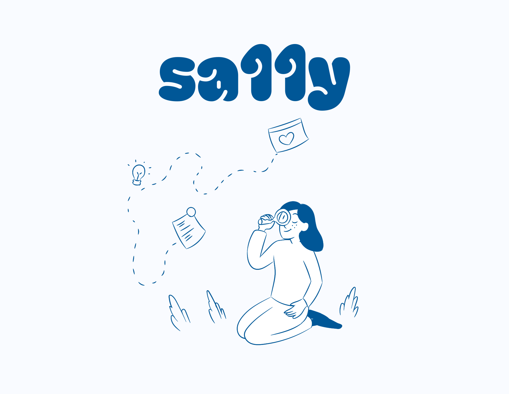

# sa11y

## About

If you are new to accessibility and want to get started without feeling overwhelmed, sa11y can provide a simple starting point.
Whether you are a designer, developer, student, or business owner, it helps you onboard to simple accessibility concepts and lets you start testing your sites for accessibility issues.

sa11y documentation covers the following points;

- Images (Alt text)
- Headings and structure
- Colours
- Fonts
- Navigation
- Links
- Forms
- Touch targets
- Responsive content

## Roadmap

- Add videos for each point

- Improve mobile navigation

## Feedback

If you have any feedback, please reach out to us at support@sa11y.com
